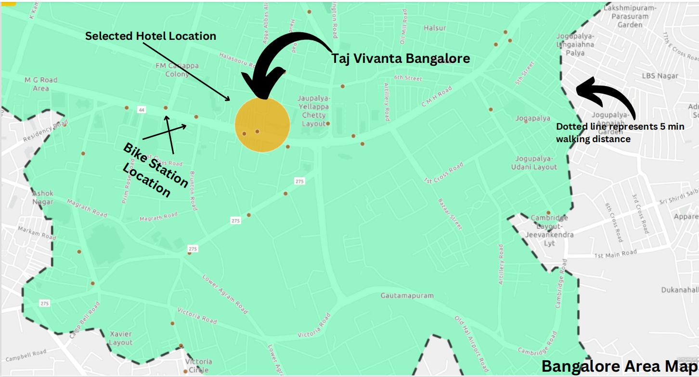

Amadeus Global Hackathon is dedicated to sustainability.Dubbed #1AHACK4SUSTAINABILITY, the virtual hackathon will invite 
600 university students from around the world to innovate and develop applications that can contribute to a more sustainable
travel experience.This wasn’t just an opportunity to tackle sustainability in travel, it was a chance for students to meet industry leaders, 
learn from new mentors, experiment with the latest in coding technology, and compete for prizes, including internships with Amadeus and other industry partners.

